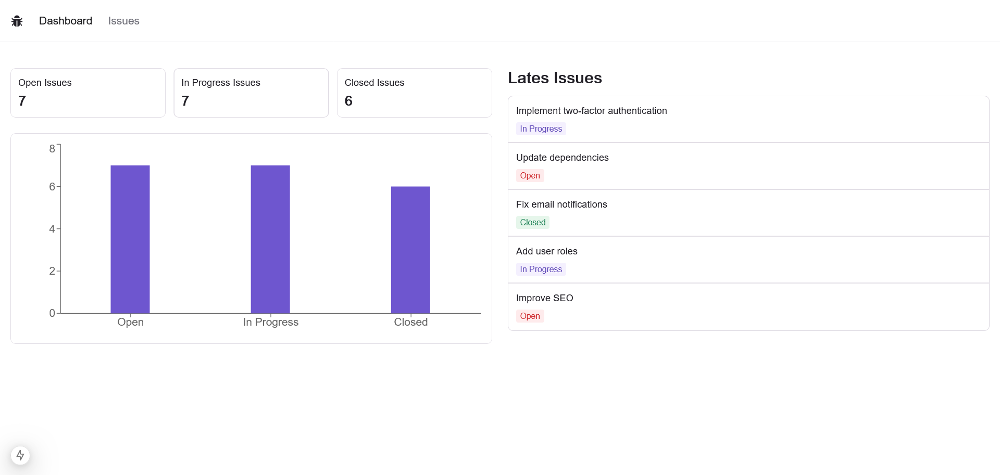

# Issue Tracker

Issue Tracker is a modern full-stack web application built with Next.js, TypeScript, Prisma, Tailwind CSS, and Radix UI. The application features full CRUD operations, allowing users to create, read, update, and delete issues. Each issue contains a title, description, and status (such as Open, In Progress, or Closed).

## 🚀 Key Features:

- **Issue Management:** Perform full CRUD (Create, Read, Update, Delete) operations on issues.
- **RESTful APIs:** Built with Next.js API routes and Prisma to manage server-side operations.
- **Routing & Navigation:** Smooth navigation between different pages including issue list, issue details, and dashboard.
- **Single Issue Page:** View detailed information about each issue on its own dedicated page.
- **ssue List with Pagination & Filtering:** Easily browse all issues with pagination controls and status-based filtering.
- **Dashboard:** Interactive chart displaying the number of issues by status and quick overview of the latest issues.

